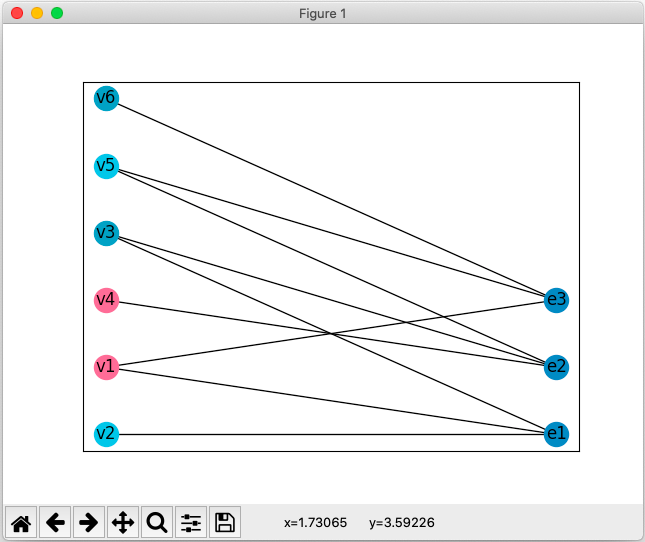

# Раскраска гиперграфа

В данном курсовом проекте реализуется минимальная допустимая (она же правильная) раскраска гиперграфа. Сам граф представляется в виде двудольного и задаётся в виде матрицы инцидентности. Это один из приближённых методов раскрашивания – Кристофидес Н. «Теория графов. Алгоритмический подход», М.: Мир, 1978 г., 432 с.

## Как запустить
Проект был написан изначально под python3.7. Однако его можно запустить и на более поздних версиях, я лишь обновил зависимости для 3.10.

```bash
$ python3 -m venv env && source env/bin/activate && pip install -r requirements.txt
```

Создаём виртуальное окружение, активируем его, устанавливаем зависимости, запускаем командой: `python main.py`.

### Пример работы
Граф, который надо задать в программе


Введение соответствующих данных. Чтобы появилось поле ввода надо задать размеры и нажать "Задать граф".


Результат после нажатия на "Раскрасить граф"

